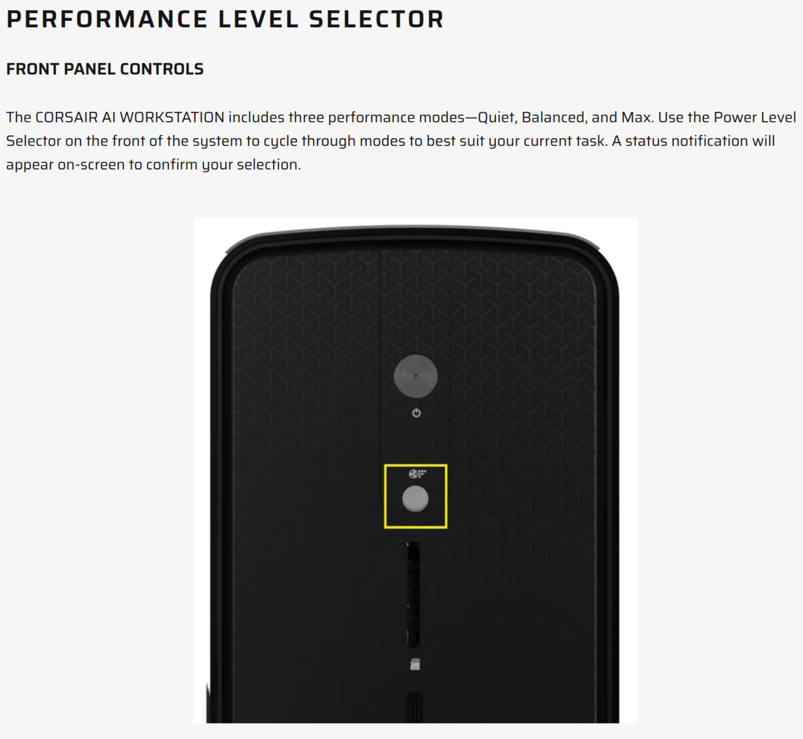
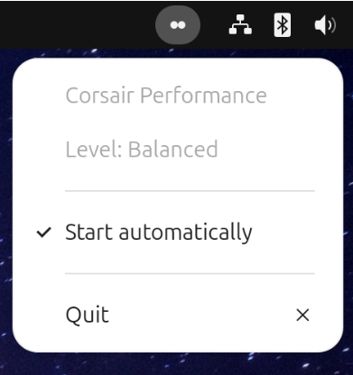

# CORSAIR AI Workstation Performance Level Linux Driver and UI

This repository is a Linux driver that exposes the CORSAIR
AI Workstation front-panel Performance Level Selector state. 

The author is not affiliated with nor endorsed by Corsair.

Tested on Ubuntu 26.04 with 7.0.0-15 kernel.



The driver has read-only support to report the current performance level:

```
$ cat /sys/bus/wmi/devices/99D89064-8D50-42BB-BEA9-155B2E5D0FCD/current_level
balanced
```

```
# Press the button while watching kernel messages
$ sudo dmesg -w 
[33373.991128] corsair_wmi: selector event detail=0x13 level_raw=1
[33373.991141] corsair_wmi: level=max raw=1 source=event
[33569.459848] corsair_wmi: selector event detail=0x11 level_raw=2
[33569.459858] corsair_wmi: level=quiet raw=2 source=event
[33572.602987] corsair_wmi: selector event detail=0x12 level_raw=0
[33572.603001] corsair_wmi: level=balanced raw=0 source=event
```

## Optional UI

The optional GNOME indicator shows the current performance level in the Ubuntu
top-right panel area. It reads:

```text
/sys/bus/wmi/devices/99D89064-8D50-42BB-BEA9-155B2E5D0FCD/current_level
```

and waits for the driver's `sysfs_notify()` updates instead of polling on a
timer. The click menu shows:



## Extremely Efficient

```
$ lsmod | grep corsair
corsair_wmi            16384  0

$ ps -C corsair-level-indicator -o pid,ppid,nlwp,vsz,rss,comm
    PID    PPID NLWP    VSZ   RSS COMMAND
  25449    6918    5 343676  4872 corsair-level-i
```

The kernel module uses about 16KB RAM while the app uses about 4.8MB and 0% CPU (blocks waiting for kernel interrupt). Written in 100% Rust for memory efficiency, memory safety, and maximum native performance.


## Installing

### Kernel Module

To install the driver for the currently running kernel and load it on future
boots, run this on the host:

```sh
./scripts/install.sh
```

By default, the script builds `corsair_wmi.ko`, signs it with the local MOK key,
installs it to:

```text
/lib/modules/$(uname -r)/extra/corsair_wmi.ko
```

It then runs `depmod`, writes:

```text
/etc/modules-load.d/corsair_wmi.conf
```

and loads the module immediately with `modprobe`.

If you build and sign inside the dev container but install from the host, run
this on the host after `corsair_wmi.ko` exists:

```sh
# In container:
./scripts/build.sh --sign

# On host:
./scripts/install.sh --no-build
```

That skips build and signing and only installs the existing module.

If Secure Boot is enabled and the signing certificate is not enrolled yet, run
the MOK import flow from "Running The Driver", reboot, then run the installer
again. The installer persists across reboots for the currently running kernel;
run it again after a kernel upgrade until DKMS packaging exists.

### Optional UI

To install the optional GNOME UI, build the release binary inside the dev
container and install the user-session assets from the host:

```sh
# In container:
./scripts/install-ui.sh --build-only

# On host:
./scripts/install-ui.sh --no-build
```

The UI installer copies the already-built binary to:

```text
~/.local/bin/corsair-level-indicator
```

It also installs a GNOME application launcher entry:

```text
~/.local/share/applications/corsair-level-indicator.desktop
```

and symbolic icons under:

```text
~/.local/share/icons/hicolor/scalable/status/
```

GNOME session autostart is controlled by:

```text
~/.config/autostart/corsair-level-indicator.desktop
```

To build the UI inside the dev container:

```sh
./scripts/install-ui.sh --build-only
```

Then run the compiled binary directly from the host, without installing Rust or
Cargo on the host:

```sh
CORSAIR_LEVEL_ICON_THEME_PATH="$PWD/icons" ./target/release/corsair-level-indicator
```

`CORSAIR_LEVEL_ICON_THEME_PATH` lets the uninstalled app find the icons from the
repository checkout. Installed copies use the user's icon theme path instead.
When installed, the menu's `Start automatically` item toggles GNOME login
startup by updating the autostart desktop entry.

The icons are intentionally simple and match the iconography on the PC case:

```text
quiet    = one circle
balanced = two circles
max      = three circles
super    = four circles
unknown  = question mark
```

If the kernel driver is not loaded or the sysfs file is missing, the indicator
starts in `Unknown` level and the menu reports that the kernel driver may be
missing.

The installer enables autostart by default on first install. If that file
already exists with `X-GNOME-Autostart-enabled=false`, reinstalling preserves
that disabled preference. The running app's `Start automatically` menu item
updates the same setting.

## Uninstall

To remove the installed module and boot autoload config:

```sh
./scripts/uninstall.sh
```

To remove the optional GNOME UI:

```sh
./scripts/uninstall-ui.sh
```

For a fuller host validation pass, see
`docs/host-test-checklist.md`.

## Current Status

Validated on one CORSAIR AI Workstation system:

- The selector state is available through ACPI WMI.
- The current level can be queried through WMI method GUID
  `99D89064-8D50-42BB-BEA9-155B2E5D0FCD`, object id `AA`, method id `2`.
- Selector change events arrive through WMI event GUID
  `8FAFC061-22DA-46E2-91DB-1FE3D7E5FF3C`, notify id `0xBC`.
- Event payloads are 8-byte buffers. The first three bytes act like:

```text
byte 0: event family, expected 0x01 for selector events
byte 1: level/event detail
byte 2: event subtype/status, observed 0x81 for selector events
```

Level mappings:

```text
Current-level query result:
0 = Balanced
1 = Max
2 = Quiet
3 = Super

Selector event byte 1:
0x11 = Quiet
0x12 = Balanced
0x13 = Max
0x14 = Super
```

The workstation firmware also emits unrelated WMI events on the same event GUID.
One commonly observed payload is:

```text
01 0a 81 00 00 00 00 00
```

That event is not a selector level event and should be ignored by a production
driver unless additional behavior is intentionally added for it.

## Supported Target

This project intentionally targets Ubuntu 26.04 with Linux 7.0+ kernels. Older
distributions and older kernel toolchains are out of scope.

The dev container is also based on Ubuntu 26.04 so its compiler, glibc, and
kernel tooling match the supported host family closely enough for out-of-tree
module builds.

Ubuntu's Rust kernel package does not expose a safe WMI driver abstraction yet,
so the driver uses a small local FFI module for `struct wmi_driver`,
`wmidev_evaluate_method()`, WMI notifications, and sysfs attributes.

## Repository Contents

```text
rust/corsair_wmi_kernel/         Rust WMI/sysfs kernel driver
rust/corsair_performance_level_core/
                                  Rust no_std-friendly decode crate
rust/corsair_level_indicator/      Optional GNOME StatusNotifier indicator
Cargo.toml                        Rust workspace manifest
Makefile                         Convenience wrapper for the Rust module build
rust/corsair_wmi_kernel/Makefile Kbuild file for the out-of-tree Rust module
scripts/build.sh                 Builds the Rust kernel module
scripts/install.sh               Installs and enables the module for boot
scripts/uninstall.sh             Removes the installed module and boot config
scripts/install-ui.sh            Builds and/or installs the optional UI
scripts/uninstall-ui.sh          Removes the optional UI
scripts/sign_for_secure_boot.sh  Low-level helper for local MOK signing
scripts/check_kernel_rust.sh      Checks/builds against the kernel Rust toolchain
LICENSE                          Repository license
```

The local Secure Boot private key is intentionally ignored. Each user must
generate and enroll their own key.

## Dev Container

The dev container installs Rust tooling plus the kernel tools needed for the
driver module. It also bind-mounts the host's `/lib/modules` and `/usr/src`
read-only so Kbuild can find matching kernel headers.

Kernel Rust builds use Ubuntu's packaged Rust compiler to match the
`linux-lib-rust-*` kernel libraries. The dev container sets:

```text
RUST_LIB_SRC=/opt/rustc/library
```

That path is copied from Ubuntu's `rust-src` package during image build because
the runtime `/usr/src` bind mount would otherwise hide the image's copy.

After changing `.devcontainer/Dockerfile` or `.devcontainer/devcontainer.json`,
rebuild the container before running the kernel module build:

```sh
./scripts/build.sh
```

## Running The Driver

Build:

```sh
./scripts/build.sh
```

This produces `corsair_wmi.ko` without a module signature. On Secure Boot
systems, build and sign in one step instead:

```sh
./scripts/build.sh --sign
```

Loading a kernel module changes the host kernel, so the `insmod`, `rmmod`, and
`dmesg` commands below must run on the host or in a container started with the
needed kernel-module privileges. A normal VS Code dev container can build and
sign the module, but may not be allowed to load it.

If Secure Boot is enabled and the signing certificate is not enrolled yet,
import the generated local Machine Owner Key after signing:

```sh
sudo mokutil --import mok/corsair_wmi.der
```

If this repository already has an older ignored `mok/corsair_wmi_probe.der`
certificate from early local testing, the signing helper used by
`build.sh --sign` will reuse it so an already-enrolled MOK continues to work.

Every rebuild replaces `corsair_wmi.ko`. If you use `sudo insmod
./corsair_wmi.ko` on a Secure Boot host, run `./scripts/build.sh --sign` after
code changes; otherwise the kernel will reject the unsigned module.

Reboot and enroll the key in the blue MOK manager screen if needed. To watch
the probe logs and then load:

```sh
sudo dmesg -w
sudo insmod corsair_wmi.ko
```

Press the front-panel selector. The driver should log decoded level events.
It also exposes read-only sysfs attributes on the method WMI device:

```text
/sys/bus/wmi/devices/99D89064-8D50-42BB-BEA9-155B2E5D0FCD/current_level
/sys/bus/wmi/devices/99D89064-8D50-42BB-BEA9-155B2E5D0FCD/current_level_raw
```

Unload:

```sh
sudo rmmod corsair_wmi
```

## Rust Core

The Rust crate contains the stable decode contract in a form that can be tested
without loading a kernel module:

```sh
cargo test
cargo clippy --all-targets -- -D warnings
```

It is deliberately small and `no_std`-friendly:

- `Level::from_query_value()`
- `Level::from_event_detail()`
- `is_selector_event()`
- `decode_selector_event()`

The kernel driver has a local copy of the same tiny decode contract because
out-of-tree kernel Rust modules are built by Kbuild rather than Cargo.

## Kernel Rust Toolchain

The target kernel has Rust enabled, and out-of-tree Rust module builds need the
matching Ubuntu Rust compiler plus prebuilt Rust kernel libraries. Check the
host/container setup and build the driver module with:

```sh
./scripts/check_kernel_rust.sh
```

If the script reports missing `libcore.rmeta`, `libkernel.rmeta`, or
`libpin_init.rmeta`, install the matching package on the host:

```sh
sudo apt install linux-lib-rust-$(uname -r)
```

Then rebuild/reopen the dev container so the `/usr/src` bind mount exposes that
package. The dev container uses Ubuntu's packaged `rustc` rather than rustup so
the compiler matches those kernel libraries. Once present, the script builds
`corsair_wmi.ko`.

## Driver Implementation Guide

A production driver must bind to the two WMI GUIDs:

```text
8FAFC061-22DA-46E2-91DB-1FE3D7E5FF3C   event source, notify id 0xBC
99D89064-8D50-42BB-BEA9-155B2E5D0FCD   method device, object id AA
```

Recommended behavior:

1. Bind to both WMI devices.
2. When the method device probes, call method id `2` on instance `0`.
3. Decode integer return values as the current level.
4. Cache the current level in driver state.
5. When the event device receives a notification, accept only selector payloads:

```text
length >= 3
payload[0] == 0x01
payload[2] == 0x81
payload[1] in { 0x11, 0x12, 0x13, 0x14 }
```

6. Decode `payload[1]` as the new level and update the cached level.
7. Notify userspace when the cached level changes.

Implemented sysfs interface:

```text
/sys/bus/wmi/devices/<method-guid>/current_level
```

The file should be read-only and return one lowercase level name:

```text
quiet
balanced
max
super
unknown
```

An optional numeric file is also useful for scripts:

```text
/sys/bus/wmi/devices/<method-guid>/current_level_raw
```

Suggested raw values:

```text
0 = balanced
1 = max
2 = quiet
3 = super
255 = unknown
```

Level-change notifications are emitted with `sysfs_notify()` on `current_level`
and `current_level_raw`. A userspace daemon can then poll the sysfs file or use
inotify-like mechanisms depending on the desired integration.

Do not call method id `1` for read-only support. Method id `1` is treated as the
level setter by the firmware interface.

## Approaches Evaluated

These paths were useful to understand the platform but are not recommended as
the final implementation:

- ACPI GPE counters: selector presses often incremented a GPE counter, but the
  counter also changed for unrelated reasons and did not carry the level value.
- Generic uevent monitoring from userspace: useful for seeing that WMI devices
  exist, but it did not expose the event payload.
- WMI BMOF/data block dumps: confirmed GUID/object metadata, but did not provide
  a reliable current-level signal.
- Platform profile sysfs: the system exposed platform-profile-related kernel
  pieces, but not a usable profile state for this selector.

The WMI method/event path is the working approach.
